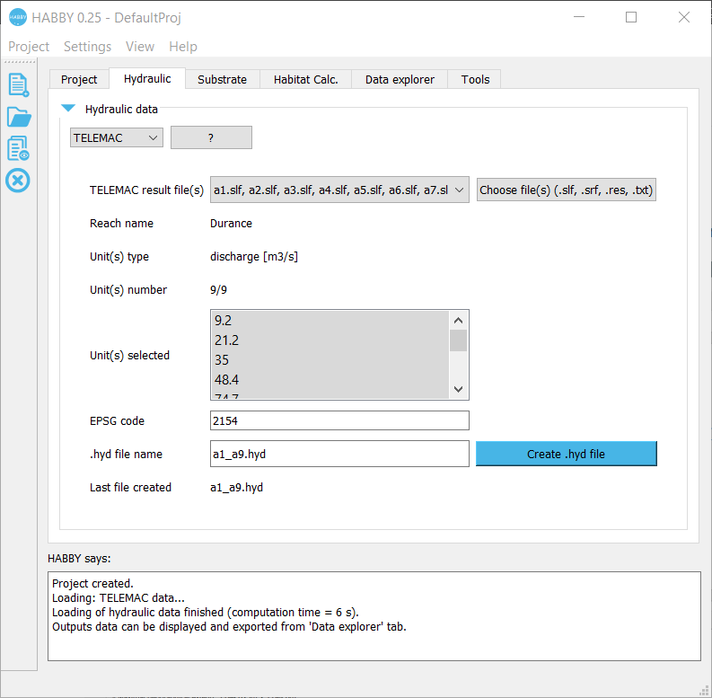

# HABBY : HABitat suitaBilitY

**Habby** is an open source software developed by the [French Agency dedicated to Biodiversity (AFB)](https://www.afbiodiversite.fr/), the national research institute [Irstea](http://www.irstea.fr/en/accueil) and [EDF](https://www.edf.fr/en/meta-home) the French electricity group. It is available under three operating systems Windows/Mac/Linux and its Graphical User Interface (GUI) is available in different languages: English, French and Spanish.

One of its main functionality is to predict fish microhabitat use at various discharges by implementing the technique of Instream Flow Incremental Methodology (1). This approach requires hydraulic simulations. **Habby** accepts the outputs from various 2D models, and in case of 1D models the outputs are interpolated to 2D. Currently eight models could be used: HEC-RAS, LAMMI, MASCARET, River2D, RUBAR-BE, RUBAR20, SW2D, TELEMAC. An interesting feature of **Habby** is to convert the different hydraulic outputs into HDF5 file format which is an international binary and self-describing system, designed to store and organize large amounts of data. So adding a new hydraulic model into **Habby** would only require programming the conversion of its outputs files into the HDF5 format.

**Habby** integrates common habitat suitability curves for fish species/guild/stages used in France. If necessary users can add curves by filling an XML file. This self-descriptive format can contains the hydrosignature (2) of the sampling data used to calculate the curves. Some others biological models, like multivariate suitability indexes crossing depth, current velocity and substrate, are currently under development.

River Discharge Time Series can be provided to Habby in order to build habitat chronicles within the ranges of simulated discharges and validated biological models.

  

   <b>Habitat Suitability Index for adult barbel computed by HABBY</b> 

In addition three statistical models can be used. They provide fast results that are close to the classical instream habitat models. They only requires the average hydraulic characteristics of stream reaches at different discharge rates, such as **Estimhab** (3) which needs the mean depth and the mean width. To be operational these models requires several results of classical studies to define the statistical equations for usable fish species/guild/stages.

When using the **Habby** GUI, scripts are automatically generated which allows users to re-launch a set of instructions easily by the Text User Interface (TUI). **Habby** files and scripts of a given project can be stored in a database which ensures of the transparency of biological results which could be useful to the contracting authority to check the process integrity . Moreover, complex operations can be launched automatically using the scripting language, preventing users from ‘mouse tendonitis’. For instance **Habby** has been tested successfully on a 2D hydraulic simulation of 47 km of Durance River (southern France) representing a mesh of about 960,000 elements, on Windows, without needing the computing power of a server. A personal computer was sufficient to run it. 

# Installation 
**Habby** can be directly used from the Python sources. It requires Python 3 with PyQt5 and some additional modules to be installed like h5py, triangle or pyshp.

A 64 bit Windows executable is also provided that includes all the requirements to run the program in a GUI mode.

  

   <b>Habby software (Windows version)</b> 

# References

* (1)	Bovee K.D., “Development and evaluation of habitat suitability criteria for use in the Instream Flow Incremental Methodology”, United States Fish and Wildlife Service, Biological Report, Instream Flow Information Paper 21, (1986), 235 pp.
* (2)	Le Coarer Y., "Hydraulic signatures for ecological modelling at different scales”, Aquatic Ecology, Vol. 41, (2007), pp 451-459.
* (3)	Lamouroux N, Capra H. 2002., “Simple predictions of instream habitat model outputs for target fish populations”, Freshwater Biology, 47(8):1543-1556.

# License
[CeCILL](http://www.cecill.info/index.en.html) v2.1

# Contributors

Contributions are always welcome ;-)

When contributing to **Habby** please consider discussing the changes you wish to make via issue or e-mail to the maintainer.

